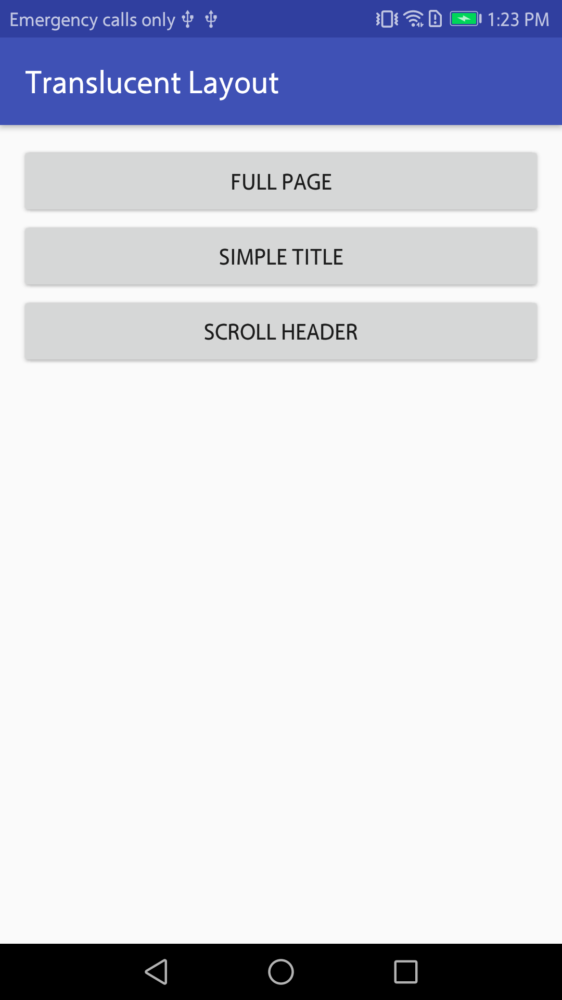
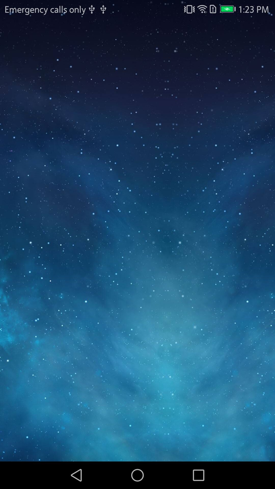
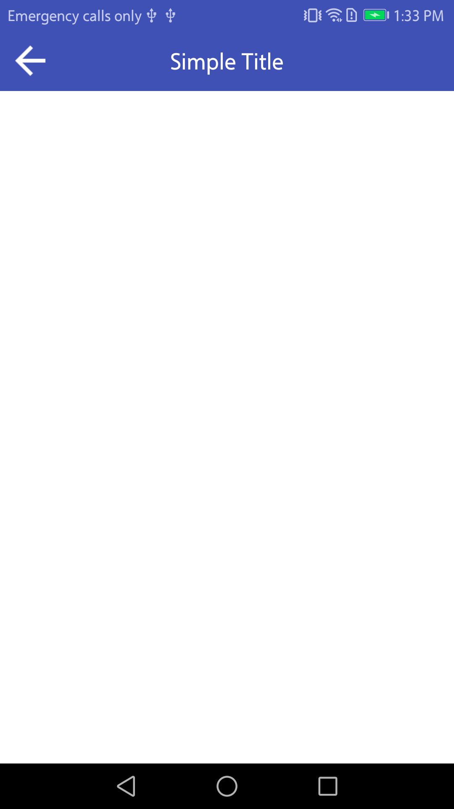

# Translucent Layout

[](https://jitpack.io/#VerstSiu/translucent_layout)

Translucent status bar effect for common layout without change activity theme.

## Preview






## Download

1. Add `jitpack` repository to all project's `build.gradle`.
    
    ```gradle

    allprojects {
      repositories {
        ...
        maven { url 'https://jitpack.io' }
      }
    }

    ```

2. Add dependency to app `build.gradle`.
    
    ```gradle

    dependencies {
      compile 'com.github.VerstSiu.translucent_layout:lib.translucent_layout:1.0'
    }

    ```

## Get Start

1. Set `Activity` theme to `NoActionBar` and `StatusBarTransparent`.

    manifest:
    
    ```xml

    <application>

      <activity
        android:theme="AppTheme.NoActionBar.StatusBarTransparent"/>

    </application>

    ```

    styles:
    
    ```xml

    <style name="AppTheme.NoActionBar" parent="AppCompat.Theme.Light.NoActionBar"/>


    <style name="AppTheme.NoActionBar.StatusBarTransparent">
    </style>

    ```

    styles-v21:
    
    ```xml

    <style name="AppTheme.NoActionBar.StatusBarTransparent">
      <item name="android:statusBarColor">@android:color/transparent</item>
    </style>

    ```

2. Replace parent layout with "TransXXX`.
    
    ```xml

    <com.ijoic.translucent_layout.TransLinearLayout
      xmlns:android=".."
      ..
      android:fitsSystemWindow="true">
    
      <com.ijoic.translucent_layout.TransLinearLayout
        ..
        android:fitsSystemWindow="true">
    
      </com.ijoic.translucent_layout.TransLinearLayout>

      ..

    </com.ijoic.translucent_layout.TransLinearLayout>

    ```

## License

```

   Copyright 2017 VerstSiu

   Licensed under the Apache License, Version 2.0 (the "License");
   you may not use this file except in compliance with the License.
   You may obtain a copy of the License at

       http://www.apache.org/licenses/LICENSE-2.0

   Unless required by applicable law or agreed to in writing, software
   distributed under the License is distributed on an "AS IS" BASIS,
   WITHOUT WARRANTIES OR CONDITIONS OF ANY KIND, either express or implied.
   See the License for the specific language governing permissions and
   limitations under the License.

```